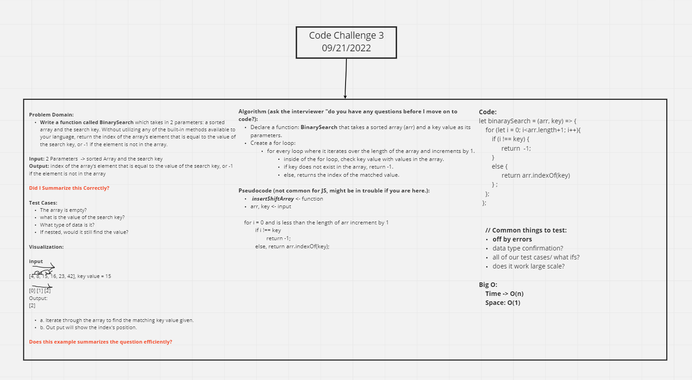

# Code Challenge 3 Insert Array Shift

Collaborator: Junyoung Son

## Array Binaray Search

- Write a function called `BinarySearch` which takes in 2 parameters: a sorted array and the search key. Without utilizing any of the built-in methods available to your language, return the index of the array’s element that is equal to the value of the search key, or -1 if the element is not in the array.

## Whiteboard Process

- Image of whiteboard process:! 

## Approach & Efficiency

- Jun and I worked on a little more simplicity with this challenge, focusing on the layout of the code and visualization. In the algorithm, we focused on the inside of the for loop and what we wanted each if else statement to return. From there, we finalized the pair programing with the code section by setting the "key" value inside of the parameter from the function and used this value throughout the for loop.
