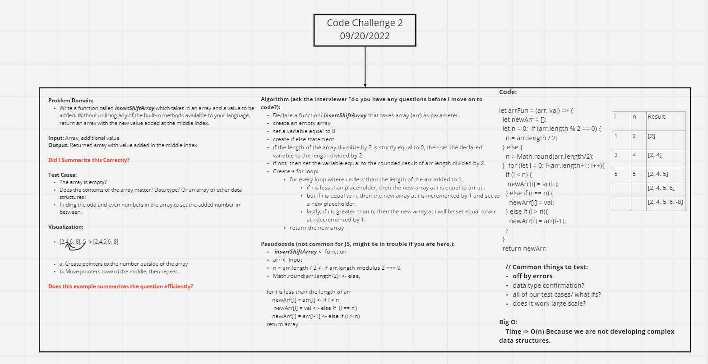

# Code Challenge 2 Insert Array Shift

Collaborator: Hayden Cleaver

## Insert Array Shift

- Write a function called `insertShiftArray` which takes in an array and a value to be added. Without utilizing any of the built-in methods available to your language, return an array with the new value added at the middle index.

## Whiteboard Process

- Image of whiteboard process: 

## Approach & Efficiency

- It was important to listen to both ny side and Hayden's side of how to solve this challange. We spent the most time on Algorithm section to develop each step. We decided to work on building a set of conditional statements then produce a for loop with the place holder involved from the first conditional statements. From here, the loop was made for the purpose of adding each value into it's proper index until the array was complete with the middle value added.
