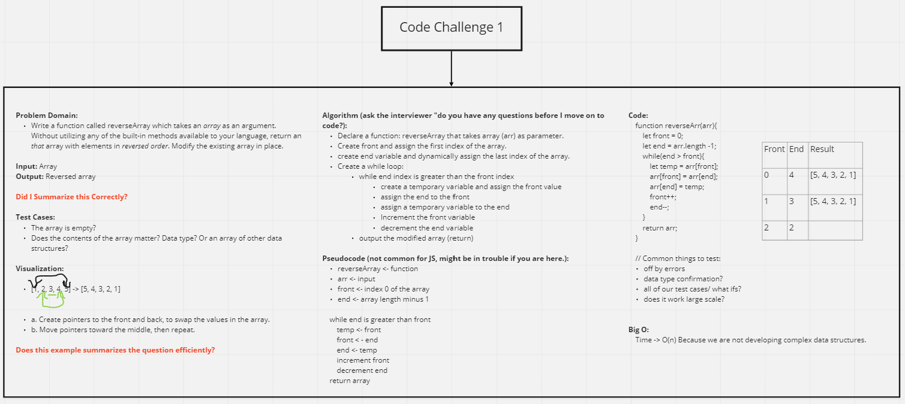

# Reverse an Array

- Write a function called `reverseArray` which takes an array as an argument. Without utilizing any of the built-in methods available to your language, return an array with elements in reversed order.

## Whiteboard Process

- Image of the whiteboard process: 

## Approach & Efficiency

- I took the approach of the instructor's model from the lecture today. We set time as Time -> O(n) Because we are not developing complex data structures.
