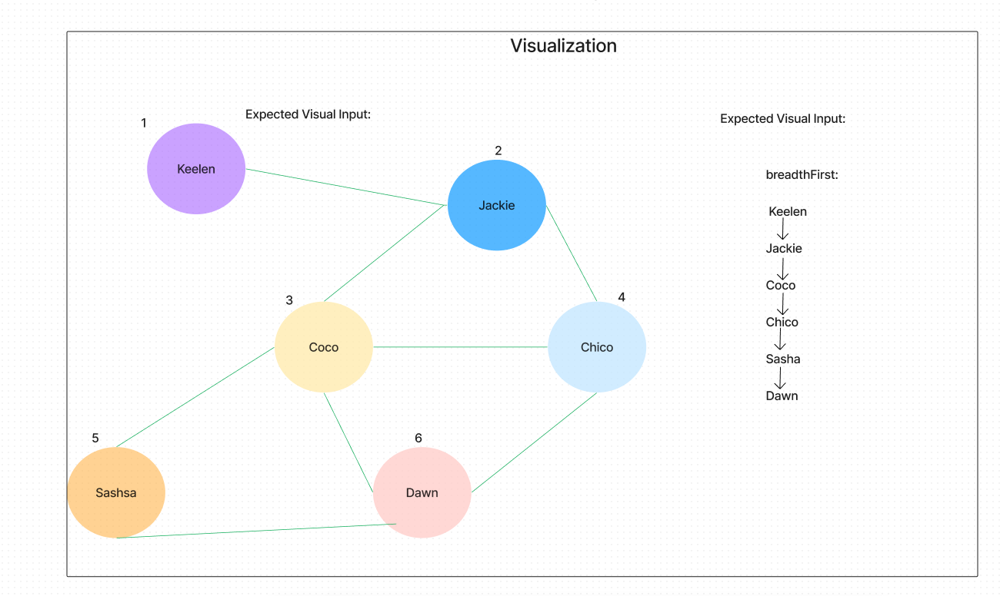

# Code Challenge: Graph-Breadth-First

## Challenge

- Implement a breadth-first traversal on a graph.

## Feature

- Write the following method for the Graph class:

  - breadth first
  - Arguments: Node
  - Return: A collection of nodes in the order they were visited.
  - Display the collection

## Approach and Efficiency

Build a function within an already-built graph class that takes in a root and a callback. Then with provided resources, create a new set and return that new set after all of the edges has been added.

In the test we will use jest and call the file that contains the function, create an example of a graph that has vertexes and edges, and set expect methods for a fully operational testing description.

- Time Complexity: O(n^2) if we represent the graph by adjacency matrix (Which we do.)

- Space Complexity: O(n) All depends on the depth of the graph which could be as long as needed

## API

- [Link to Code:](../Graph/graph.js)

- NOTE: The breadthFirst function is already established in the graph.js file from yesterday's code challenge. This function will apply to today's code challenge. Function declaration starts at line 75.

- [Link to PR:](https://github.com/Keelen-Fisher/data-structures-and-algorithms/pull/73)

- [Link to Test:](../Graph/__tests__/graph-breadth-first.test.js)

## UML Diagrams Made:

## Resources and Credit

- [Link to Graph BFS and DFS Data Structures in js:](chrome-extension://efaidnbmnnnibpcajpcglclefindmkaj/http://www.sfu.ca/~arashr/parminder.pdf)
