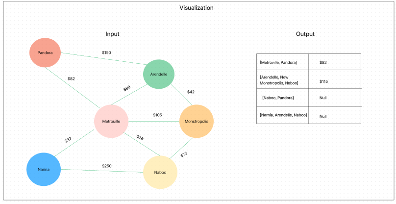

# Code Challenge: Graph-Business-Trip (Find Edges)

## Challenge

- Given a business trip itinerary, and an Alaska Airlines route map, is the trip possible with direct flights? If so, how much will the total trip cost be?

## Feature

- Write a function called business trip
- Arguments: graph, array of city names
- Return: the cost of the trip (if it’s possible) or null (if not)

> Determine whether the trip is possible with direct flights, and how much it would cost.

## Approach and Efficiency

Build a function that utilizes the Edge class and traversal method through a graph. This function is to take in a graph along with an array of city names. Since the goal of the output is to deliver a cost of each trip, the approach could be to implement a method that can return each edge (or console.log()).

- Time Complexity: O(n^2) if we represent the graph by adjacency matrix (Which we do.)

- Space Complexity: O(n) All depends on the depth of the graph which could be as long as needed (how many trips are there?)

## API

- [Link to Code:](../Graph/graph-business-trip.js)

- [Link to PR:]()

- [Link to Test:](../Graph/__tests__/graph-breadth-first.test.js)

## UML Diagrams Made:

- 

## Resources and Credit

- [Link to Graph BFS and DFS Data Structures in js:](chrome-extension://efaidnbmnnnibpcajpcglclefindmkaj/http://www.sfu.ca/~arashr/parminder.pdf)
