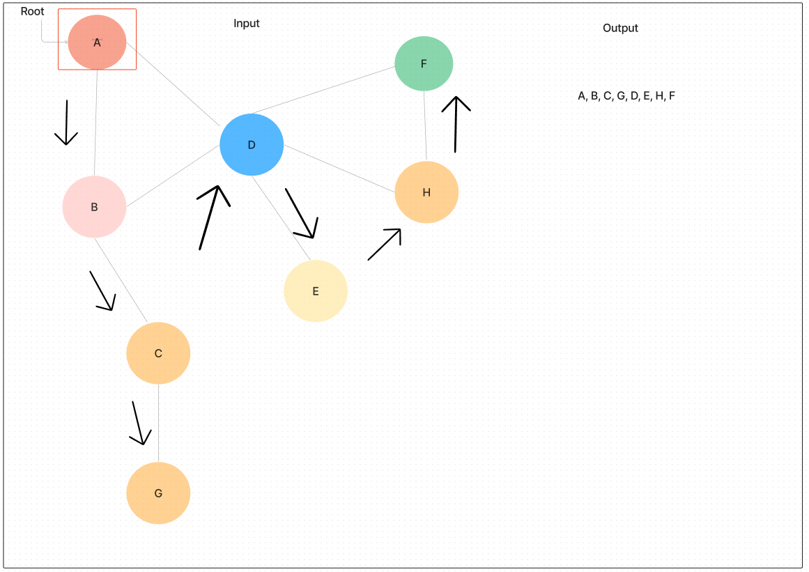

# Code Challenge Graph-Depth-First

## Challenge

- Conduct a depth first preorder traversal on a graph

## Feature Tasks

- Name: Depth first
- Arguments: Node (Starting point of search)
- Return: A collection of nodes in their pre-order depth-first traversal order
- Program output: Display the collection

## Approach and Efficiency

Build a function that takes in a node as an argument from a previously built graph class. This is set for preorder traversal, so a while loop will be implemented along with conditional statements to test the position and current value.

- Time Complexity: O(n^2) if we represent the graph by adjacency matrix (Which we do.)

- Space Complexity: O(n) All depends on the depth of the graph which could be as long as needed

## API

- [Link to Code:](../Graph/graph-depth-first.js)

- NOTE: The breadthFirst function is already established in the graph.js file from yesterday's code challenge. This function will apply to today's code challenge. Function declaration starts at line 75.

- [Link to PR:]()

- [Link to Test:](../Graph/__tests__/graph-depth-first.test.js)

## UML Diagrams Made:

## Resources and Credit

- [Link to Graph BFS and DFS Data Structures in js:](chrome-extension://efaidnbmnnnibpcajpcglclefindmkaj/http://www.sfu.ca/~arashr/parminder.pdf)
