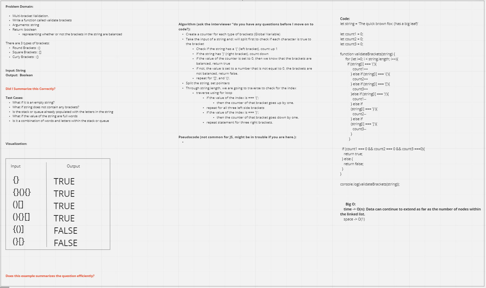

# stack-queue-pseudo

- The plan for today is to create a function that takes an string and checks for 3 types of Brackets, returns true or false depending on the string.

## Challenge

- Multi-bracket Validation.

## Approach & Efficiency

- We approached the problem by trying to develop a function that loops the a string that we created. We created conditional statements to check for brackets and return counter that is set to 0 to be true, if not, then false.

## API
<!-- Description of each method publicly available to your Stack and Queue-->
[Link to code:](index.js)

[Link to PR:](https://github.com/Keelen-Fisher/data-structures-and-algorithms/pull/38)

[Link to stack-queue folder](https://github.com/Keelen-Fisher/data-structures-and-algorithms/blob/main/javascript/stack-queue/index.js)

- Partners

  - Stephen Clemmer
