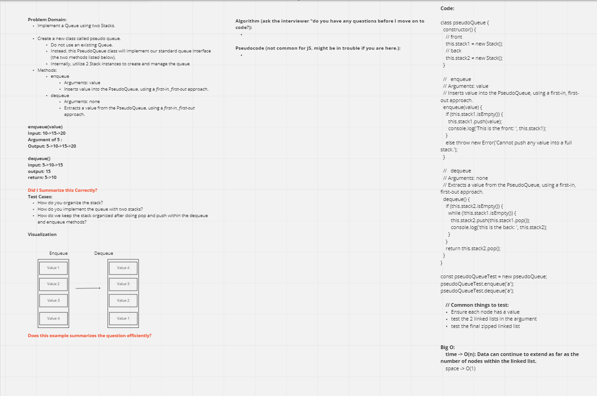

# stack-queue-pseudo

- The plan for today is to create queue methods using two stacks. By doing this, we will create a new class and then implement standard queue interface using the enqueue and dequeue methods.

## Challenge

- Implement a Queue using two Stacks.

## Approach & Efficiency

- We decided to work on the visualization and understanding how both the stacks will work in enqueue and dequeue methods, moving one node at a time.

## API
<!-- Description of each method publicly available to your Stack and Queue-->
[Link to code:](index.js)

[Link to PR:](https://github.com/Keelen-Fisher/data-structures-and-algorithms/pull/39)

[Link to stack-queue folder](https://github.com/Keelen-Fisher/data-structures-and-algorithms/blob/main/javascript/stack-queue/index.js)

- Partners

  - Stephen Martinez

  - Daniel Frey
