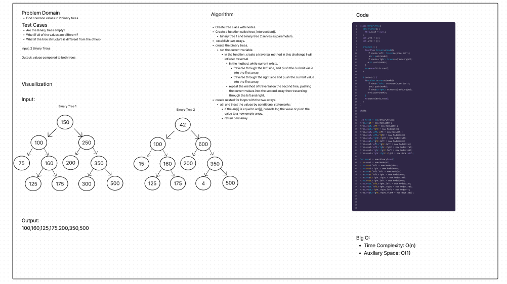

# Code Challenge: Tree-Intersection

## Challenge

- Find common values in 2 binary trees.

## Feature Tasks

- Write a function called tree_intersection that takes two binary trees as parameters.

- Using your Hashmap implementation as a part of your algorithm, return a set of values found in both trees.

## Approach & Efficiency

Time complexity - Linear O(n) Space complexity - Linear O(n)

## API

The approach is to apply the notes and lecture given by the instructor to create a fully fledged Hash Table. In addition, apply resources gained from research to find common values between 2 binary trees.

## UML

- [Link to code:](../treeIntersection/tree-intersection.js)

- [Link to PR:](https://github.com/Keelen-Fisher/data-structures-and-algorithms/pull/58)

- [Link to test:](../treeIntersection/__tests__/tree-intersection.test.js)
