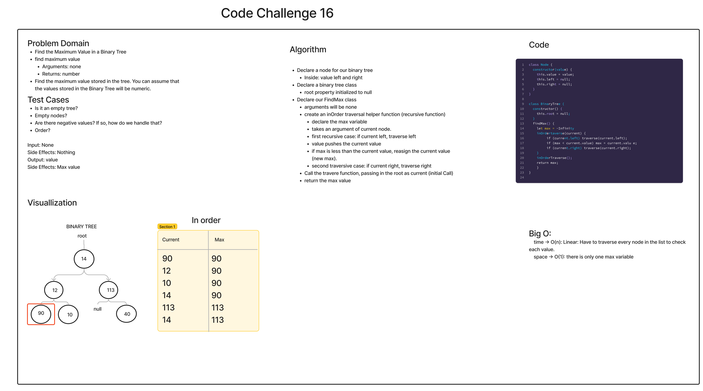

# Code Challenge: Trees

## Challenge

- Find the Maximum Value in a Binary Tree

- Type: Extending an Implementation

## Approach

- Today's approach was to work on the test cases and make sure that we checked off any cases that may interrupt the algorithm and code. Transitioning to the input and output, We included the side effects with the help of Branden Ge. We then moved over to visualization, algorithm and Code.

### Method:

- Write the following method for the Binary Tree class

  - find maximum value
    - Arguments: none
    - Returns: number
- Find the maximum value stored in the tree. You can assume that the values stored in the Binary Tree will be numeric.

## API

- [Link to code:](trees-max.js)

- [Link to PR:](https://github.com/Keelen-Fisher/data-structures-and-algorithms/pull/42)

- [Link to trees folder](https://github.com/Keelen-Fisher/data-structures-and-algorithms/tree/main/javascript/trees)

- [Link to test:]()

- 
